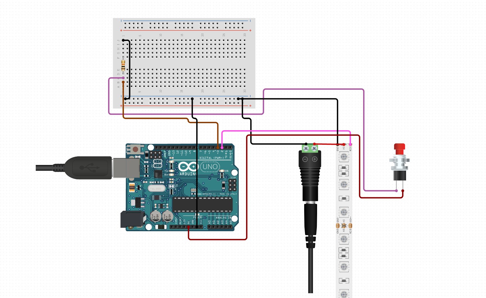

## Layout

Components: More info about the wiring diagram is found [here at circuito.io](https://www.circuito.io/app?components=512,11021,12027,942700)

## Parts Required

-   Arduino (a Nano or Uno would suffice)
-   Any generic WS2812B individually addressible light strip (though "Neopixel" will be the most recognizable term)
-   A momentary push button
-   One 10k Ohm resistor
-   A breadboard (shown in the diagram but totally optional)
-   A 5V power supply, 2A+ probably depending on how many lights you're running
